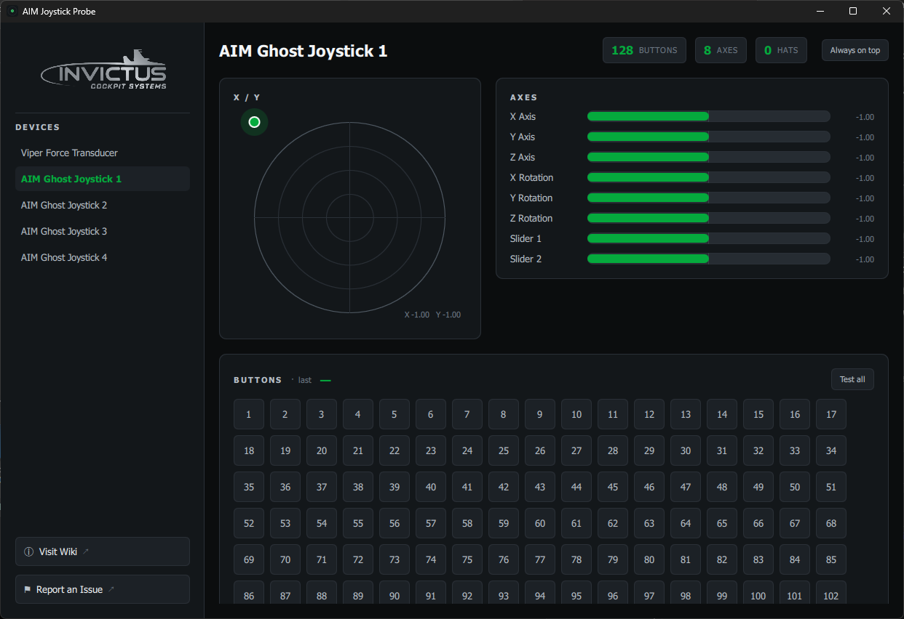

# AIM Joystick Probe

A modern, free joystick tester for Windows that shows **every** button on your
controller — including all **128 buttons** on AIM Ghost Joysticks that Windows'
built-in tester can't display.

## Why it exists

Windows' built-in game-controller panel caps the button display at **32**. AIM
Ghost Joysticks expose **128 buttons**, so most of them are invisible there. AIM
Joystick Probe reads the controller directly and shows every button, axis, and
POV hat at once.

## Download

Get the latest **AIM-Joystick-Probe-Setup.exe** from the
[**Releases**](https://github.com/invictuscockpits/aim-joystick-probe-releases/releases)
page.

The installer and the app are code-signed by Invictus Machine LLC, so Windows
installs them without flagging an unknown publisher. It installs **per-user — no
administrator rights required**. There's a step-by-step install guide in the
[Wiki](https://github.com/invictuscockpits/aim-joystick-probe-releases/wiki/Getting-Started).

## Features

- **Full button map** — all 128 buttons, live, with no 32-button cap
- **X / Y axis pad** — concentric-ring view with a live position dot
- **Axes & POV hats** — familiar names you already know from the Windows panel
- **Test-All mode** — latches each button as you press it, with a running tested
  count, so you can confirm every control on a freshly built panel
- **Last-pressed and held-count** readouts for quick stuck-input and wiring checks
- **AIM Ghost control labels** — buttons on an AIM Ghost Joystick show the F-16
  cockpit control they're mapped to
- **Always-on-top** toggle and a remembered window size
- **Automatic update check** with an in-app banner when a newer version is available

## Documentation

The full guide lives in the
[**Wiki**](https://github.com/invictuscockpits/aim-joystick-probe-releases/wiki).

## Support

- **Questions or bugs** — open an
  [issue](https://github.com/invictuscockpits/aim-joystick-probe-releases/issues).
- **Updates** — the app checks for a newer version on launch; you can also watch
  this repository's Releases.

## License

AIM Joystick Probe is **free to use**. It is proprietary freeware: you may use it
at no cost, but it may not be redistributed, modified, reverse-engineered, or
rebranded. See the license shown in the app.

---

© 2026 Invictus Cockpit Systems
